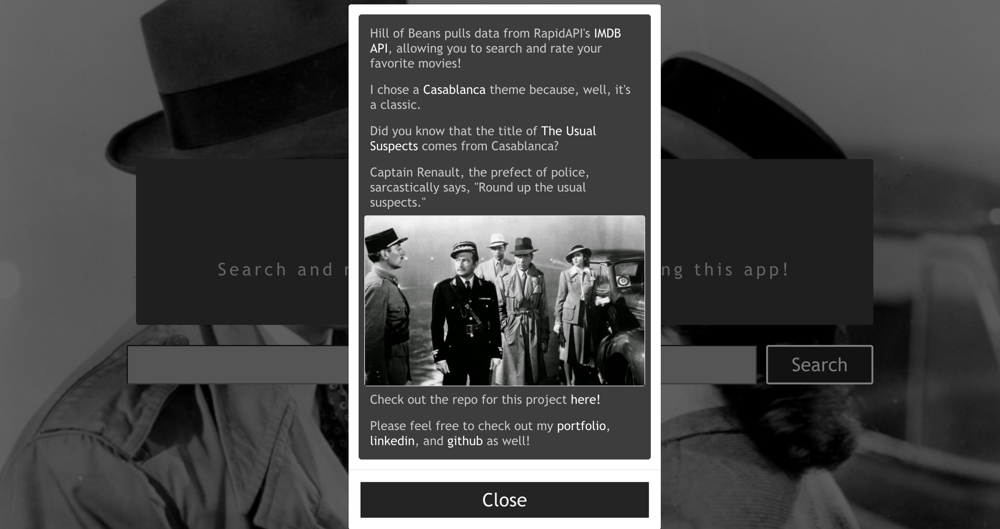
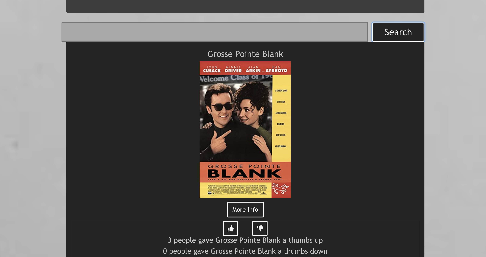
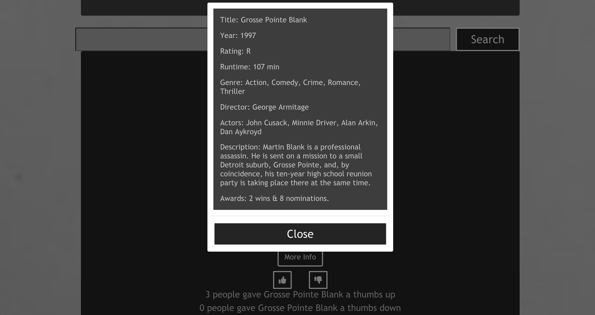

## Welcome to Hill of Beans!

Here is a link to the deployed version:
https://hill-of-beans-db.herokuapp.com/

Here are some screenshots from the deployed version:

Hill of Beans is a movie search app built on a React frontend and Rails backend. Indecision displays data from RapidApi's Movie Database (IMDB Alternative), which can be found here: 
https://rapidapi.com/rapidapi/api/movie-database-imdb-alternative

This app utilizes both the search endpoints (to get a set of results) and the find by endpoints (to take each entry in the set of results and append additional data).

All endpoints are readily available in the RapidAPI documentation, and all information is in the first layer of the response data object. 

This tutorial also walks you through building a search in React using RapidAPI; it came in handy when I was trying to figure out how to use headers and parameters in my functions:

https://rapidapi.com/blog/imdb-api-javascript-react/

Users can search movies by title and see:

- Title
- Poster (image url)

Then they can view results and click on a modal to view the following information: 

- Year
- Rating
- Runtime 
- Genre
- Director
- Actors
- Plot
- Awards

After looking through the movie information, users can add their rating by clicking on a "thumbs up" or "thumbs down" button. The app includes functions that save these ratings on a rails backend, the repo for which can be found here:

https://github.com/Jess-White/indecision_backend

Here's some basic information on building a rails database:

https://guides.rubyonrails.org/v2.3/getting_started.html

For styling, I used react-bootstrap because it's straightforward and mobile-friendly. Documentation can be found here:

https://react-bootstrap.github.io/

Read on for some npm and React basic info:

# Getting Started with Create React App

This project was bootstrapped with [Create React App](https://github.com/facebook/create-react-app).

## Available Scripts

In the project directory, you can run:

### `yarn start`

Runs the app in the development mode.\
Open [http://localhost:3000](http://localhost:3000) to view it in the browser.

The page will reload if you make edits.\
You will also see any lint errors in the console.

### `yarn test`

Launches the test runner in the interactive watch mode.\
See the section about [running tests](https://facebook.github.io/create-react-app/docs/running-tests) for more information.

### `yarn build`

Builds the app for production to the `build` folder.\
It correctly bundles React in production mode and optimizes the build for the best performance.

The build is minified and the filenames include the hashes.\
Your app is ready to be deployed!

See the section about [deployment](https://facebook.github.io/create-react-app/docs/deployment) for more information.

### `yarn eject`

**Note: this is a one-way operation. Once you `eject`, you can’t go back!**

If you aren’t satisfied with the build tool and configuration choices, you can `eject` at any time. This command will remove the single build dependency from your project.

Instead, it will copy all the configuration files and the transitive dependencies (webpack, Babel, ESLint, etc) right into your project so you have full control over them. All of the commands except `eject` will still work, but they will point to the copied scripts so you can tweak them. At this point you’re on your own.

You don’t have to ever use `eject`. The curated feature set is suitable for small and middle deployments, and you shouldn’t feel obligated to use this feature. However we understand that this tool wouldn’t be useful if you couldn’t customize it when you are ready for it.

## Learn More

You can learn more in the [Create React App documentation](https://facebook.github.io/create-react-app/docs/getting-started).

To learn React, check out the [React documentation](https://reactjs.org/).

### Code Splitting

This section has moved here: [https://facebook.github.io/create-react-app/docs/code-splitting](https://facebook.github.io/create-react-app/docs/code-splitting)

### Analyzing the Bundle Size

This section has moved here: [https://facebook.github.io/create-react-app/docs/analyzing-the-bundle-size](https://facebook.github.io/create-react-app/docs/analyzing-the-bundle-size)

### Making a Progressive Web App

This section has moved here: [https://facebook.github.io/create-react-app/docs/making-a-progressive-web-app](https://facebook.github.io/create-react-app/docs/making-a-progressive-web-app)

### Advanced Configuration

This section has moved here: [https://facebook.github.io/create-react-app/docs/advanced-configuration](https://facebook.github.io/create-react-app/docs/advanced-configuration)

### Deployment

This section has moved here: [https://facebook.github.io/create-react-app/docs/deployment](https://facebook.github.io/create-react-app/docs/deployment)

### `yarn build` fails to minify

This section has moved here: [https://facebook.github.io/create-react-app/docs/troubleshooting#npm-run-build-fails-to-minify](https://facebook.github.io/create-react-app/docs/troubleshooting#npm-run-build-fails-to-minify)
